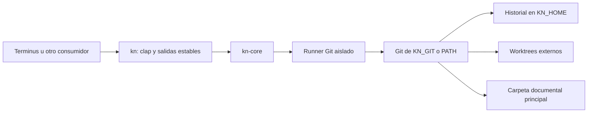

# Arquitectura de kn

kn organiza sesiones de agentes sobre carpetas de documentos. Terminus u otro consumidor decide cuándo usarlo; una carpeta de código sigue el flujo Git de ese consumidor. Una persona puede editar la carpeta documental sin instalar kn.

## Componentes y dependencias

| Componente | Responsabilidad | Fuente |
| --- | --- | --- |
| CLI | Parseo, alias, `-C`, salidas y exit codes | [main.rs](crates/kn/src/main.rs) |
| Workspace | Descubrimiento, UUID, ubicación, locks y `migrate` | [workspace.rs](crates/kn-core/src/workspace.rs) |
| Registro | Raíz canónica de cada principal → UUID, en KN_HOME | [registry.rs](crates/kn-core/src/registry.rs) |
| Engine | Procesos Git con variables/configuración aisladas | [git.rs](crates/kn-core/src/git.rs) |
| Operaciones | Status, diff, commit, log, restore | [ops.rs](crates/kn-core/src/ops.rs) |
| Sesiones | Crear, actualizar e integrar worktrees | [sessions.rs](crates/kn-core/src/sessions.rs) |
| Consultas | `rev-parse` y porcelain | [plumbing.rs](crates/kn-core/src/plumbing.rs) |
| Protocolo | Envelope y errores tipados | [error.rs](crates/kn-core/src/error.rs) |

Git es una dependencia de ejecución. El runner lo resuelve una vez por proceso: `KN_GIT` si está definida, y si no, el primer `git` de PATH (`git.exe` en Windows), ignorando entradas relativas. Una `KN_GIT` inválida falla con `GIT_MISSING` en vez de caer a PATH; sin ninguno, el mismo código lleva el remedio del sistema. kn no descarga ni instala Git. El runner desactiva configuración global y de sistema, hooks, firmas y normalización/filtros de contenido. Todo proceso que kn lanza se crea con `git::process`, que en Windows usa `CREATE_NO_WINDOW`: Terminus lanza kn sin consola y, sin la bandera, cada llamada a Git abriría una ventana. No hay servidor, watcher, base de datos, dependencia de Terminus ni proveedor cloud implementado.

Límite sin verificar: en macOS, `/usr/bin/git` es un lanzador de las Command Line Tools. Si no están instaladas, kn lo encuentra en PATH y la llamada falla después como `GIT_FAILED`, no como `GIT_MISSING`.

## Almacenamiento

| Ubicación | Contenido |
| --- | --- |
| `$KN_HOME/roots.json` | Registro, schema 1: raíz canónica de cada principal → UUID. Es la fuente de su identidad |
| `$KN_HOME/roots.lock` | Coordina las escrituras del registro |
| `$KN_HOME/locks/<hash>.lock` | Lock de inicialización de una raíz; el nombre es el FNV-1a de su ruta canónica |
| `$KN_HOME/repos/<uuid>/` | Objetos, referencias, índice principal y registros Git de worktrees |
| `$KN_HOME/repos/<uuid>/location.json` | Última ubicación registrada de la principal |
| `$KN_HOME/repos/<uuid>/kn.lock` | Coordinación de operaciones kn del espacio |
| `$KN_HOME/repos/<uuid>/cloud-pending.json` | Documentos de la principal que seguían en la nube en su última versión |
| `$KN_HOME/sessions/<uuid>/<nombre>/` | Documentos de sesión, gitfile y marcador `.kn/config.json` (schema 2, UUID y nombre de sesión) |
| `<principal>/.kn/config.json`, `<principal>/.kn/kn.lock` | Solo en principales inicializadas antes del registro; `kn migrate` los quita |

KN_HOME usa `~/.kn` por defecto (USERPROFILE en Windows). La principal no recibe ningún archivo de kn: ni `.git`, ni `.kn`, ni locks. Los archivos `.git` existentes del usuario se conservan. Los datos de motor y las sesiones deben estar fuera de carpetas sincronizadas; la comprobación actual solo rechaza KN_HOME dentro de la principal y la principal dentro de KN_HOME, no detecta todos los proveedores del sistema.

El UUID es local, no una identidad cloud compartida. El registro, la ubicación y los marcadores de sesión usan escritura temporal y rename; esto no hace atómico todo un commit o checkout. Git sigue siendo la fuente de HEAD: no se duplica su valor en un state.json.

## Identidad de una carpeta

La identidad de una principal vive en `$KN_HOME/roots.json`, por su ruta canónica, y no dentro de la carpeta. Así una carpeta de Drive u OneDrive no lleva nada de kn a otras máquinas, y cada máquina que la inicializa tiene su propio historial. La identidad no se deduce de `repos/*/location.json`, porque varios historiales pueden apuntar a la misma raíz: los que dejó un init fallido y el anterior a `init --fresh`. `location.json` sigue guardando dónde está la principal de cada historial; es como una sesión la encuentra.

Para descubrir la carpeta, kn sube desde el directorio de trabajo y se queda con la más cercana que cumpla una de estas condiciones, en este orden:

1. Está registrada en `roots.json`: es una principal. kn no lee su `.kn`, que puede haber llegado por sincronización.
2. Tiene `.kn/config.json` con `session`: es una sesión. Las sesiones viven en `$KN_HOME/sessions` y conservan su marcador.
3. Tiene `.kn/config.json` sin `session`: es una principal inicializada antes del registro.

El descubrimiento se detiene en una carpeta con `.git`. El registro nunca contiene una sesión: `init` rechaza las carpetas dentro de una sesión o de KN_HOME.

Una principal registrada dentro de otra tiene su propio historial. La de arriba versiona los documentos de la de abajo como cualquier otro, así que lo que integra una sesión de abajo le llega como `external_observation`, como un repositorio Git anidado visto desde fuera.

Una principal con marcador anterior sigue funcionando. Las operaciones que escriben en su historial (`init`, `worktree add`, `worktree update` y `worktree finish`) la registran sin tocar el marcador; las lecturas no escriben. `commit` y `restore` en una sesión no consultan la principal y no la registran. `kn migrate` la registra y quita `.kn`. Si el historial que nombra un marcador no está en esta máquina, el marcador llegó por sincronización: `init` registra una identidad nueva y lo deja intacto.

Límites:

- Mover o renombrar una principal registrada la deja sin identidad: en la nueva ruta es `NOT_A_WORKSPACE`, e `init` allí empieza otro historial. El anterior queda en KN_HOME sin referencia, igual que tras `init --fresh`; kn no lo borra.
- El registro asocia rutas, no contenido: otra carpeta creada en una ruta registrada se trata como esa principal, y sus diferencias se registran como cambios externos.

## Flujo de edición

1. `init` registra la raíz en `roots.json` y captura los documentos iniciales. Un commit vacío interno permite abrir worktrees incluso si no hay documentos.
2. `worktree add` observa cambios manuales de la principal, registra una referencia `external_observation` y crea la sesión desde main.
3. `commit` registra una versión con los documentos permitidos de la sesión. `log` omite versiones sin cambios documentales.
4. `worktree update` observa de nuevo la principal y usa merge de Git dentro de la sesión. Los conflictos permanecen ahí.
5. `worktree finish` registra lo pendiente de la sesión (`pre_finish_snapshot`), observa la principal y exige avance fast-forward desde ella; si divergen, pide actualizar. La sesión se conserva. Es lo que una persona llama guardar: `commit` solo registra una versión dentro de la sesión.
6. `restore` registra cambios pendientes, valida el objetivo y protege obstrucciones no versionadas antes del checkout de dos árboles; registra el resultado sin reescribir HEAD hacia atrás.

Los documentos que siguen en la nube se reconocen por metadatos en [cloud.rs](crates/kn-core/src/cloud.rs) y, en cada llamada a `status` o `add`, se ocultan a Git con un archivo de exclusión temporal. La lista no se guarda: el directorio Git común lo comparten la principal y las sesiones, y una exclusión guardada ahí ocultaría en una sesión un documento nuevo del agente. En builds de depuración, `KN_TEST_CLOUD_ONLY` simula esos documentos por nombre para las regresiones. Si `init` falla, borra el historial que acababa de crear en KN_HOME.

Esa exclusión no se guarda, pero sí la lista de la principal: cada versión que kn registra ahí escribe `cloud-pending.json` junto al historial. Con ella, `status` informa `downloaded_since_last_observation` sin escribir nada, y la observación versiona primero lo descargado (`cloud_download`) y después lo demás (`external_observation`). `cloud fetch` descarga lo pendiente leyendo cada documento con un límite de espera; no crea versiones ni toma el lock durante las lecturas.

Las observaciones no conocen al autor externo. Los commits usan la identidad técnica `kn <kn@local>` y un trailer `Kn-Reason`. Los snapshots sin cambios no crean commits adicionales, salvo que Git deba terminar una integración.

## Lecturas, concurrencia y límites

Las consultas de máquina usan un lock compartido existente y no crean archivos; las operaciones de escritura usan lock exclusivo con espera máxima de dos segundos. `status`/`diff` de aplicación no cambian documentos, aunque la apertura puede crear el archivo de lock externo si falta. Las pruebas cubren copias, movimientos y ausencia de escrituras en inspect.

Los locks no inmovilizan aplicaciones externas ni clientes cloud. Una escritura concurrente o un fallo de disco puede interrumpir la captura o integración. No hay diario de recuperación, publicación atómica de múltiples archivos, importación del historial Go ni respaldo de archivos ignorados. Las carpetas vacías solo se reportan. Los detalles de interfaz están en [CLI](docs/CLI.md); la futura nube y las decisiones del producto, en [evaluación y propuesta](docs/RUST-AND-COLLABORATION.md).
