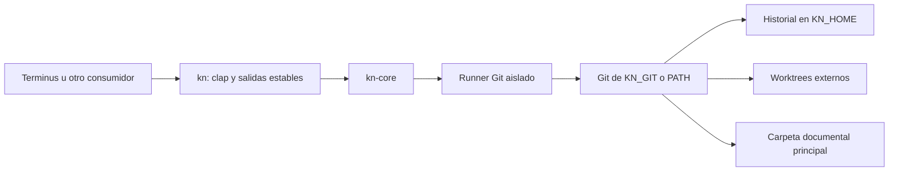

# Arquitectura de kn

kn organiza sesiones de agentes sobre carpetas de documentos. Terminus u otro consumidor decide cuándo usarlo; una carpeta de código sigue el flujo Git de ese consumidor. Una persona puede editar la carpeta documental sin instalar kn.

## Componentes y dependencias

| Componente | Responsabilidad | Fuente |
| --- | --- | --- |
| CLI | Parseo, alias, `-C`, salidas y exit codes | [main.rs](crates/kn/src/main.rs) |
| Workspace | Descubrimiento de `.kn`, UUID, ubicación y locks | [workspace.rs](crates/kn-core/src/workspace.rs) |
| Engine | Procesos Git con variables/configuración aisladas | [git.rs](crates/kn-core/src/git.rs) |
| Operaciones | Status, diff, commit, log, restore | [ops.rs](crates/kn-core/src/ops.rs) |
| Sesiones | Crear, actualizar e integrar worktrees | [sessions.rs](crates/kn-core/src/sessions.rs) |
| Consultas | `rev-parse` y porcelain | [plumbing.rs](crates/kn-core/src/plumbing.rs) |
| Protocolo | Envelope y errores tipados | [error.rs](crates/kn-core/src/error.rs) |

Git es una dependencia de ejecución. El runner lo resuelve una vez por proceso: `KN_GIT` si está definida, y si no, el primer `git` de PATH (`git.exe` en Windows), ignorando entradas relativas. Una `KN_GIT` inválida falla con `GIT_MISSING` en vez de caer a PATH; sin ninguno, el mismo código lleva el remedio del sistema. kn no descarga ni instala Git. El runner desactiva configuración global y de sistema, hooks, firmas y normalización/filtros de contenido. Todo proceso que kn lanza se crea con `git::process`, que en Windows usa `CREATE_NO_WINDOW`: Terminus lanza kn sin consola y, sin la bandera, cada llamada a Git abriría una ventana. No hay servidor, watcher, base de datos, dependencia de Terminus ni proveedor cloud implementado.

Límite sin verificar: en macOS, `/usr/bin/git` es un lanzador de las Command Line Tools. Si no están instaladas, kn lo encuentra en PATH y la llamada falla después como `GIT_FAILED`, no como `GIT_MISSING`.

## Almacenamiento

| Ubicación | Contenido |
| --- | --- |
| `<principal>/.kn/config.json` | Schema 2, UUID local y rol de sesión |
| `<principal>/.kn/kn.lock` | Lock de inicialización |
| `$KN_HOME/repos/<uuid>/` | Objetos, referencias, índice principal y registros Git de worktrees |
| `$KN_HOME/repos/<uuid>/location.json` | Última ubicación registrada de la principal |
| `$KN_HOME/repos/<uuid>/kn.lock` | Coordinación de operaciones kn del espacio |
| `$KN_HOME/sessions/<uuid>/<nombre>/` | Documentos de sesión, gitfile y configuración `.kn` local |

KN_HOME usa `~/.kn` por defecto (USERPROFILE en Windows). La principal no recibe un `.git` de kn. Los archivos `.git` existentes del usuario se conservan. Los datos de motor y las sesiones deben estar fuera de carpetas sincronizadas; la comprobación actual solo rechaza KN_HOME dentro de la principal, no detecta todos los proveedores del sistema.

El UUID es local, no una identidad cloud compartida. Copiar `.kn/config.json` no copia el historial. La configuración usa escritura temporal y rename; esto no hace atómico todo un commit o checkout. Git sigue siendo la fuente de HEAD: no se duplica su valor en un state.json.

## Flujo de edición

1. `init` captura los documentos iniciales. Un commit vacío interno permite abrir worktrees incluso si no hay documentos.
2. `worktree add` observa cambios manuales de la principal, registra una referencia `external_observation` y crea la sesión desde main.
3. `commit` registra una versión con los documentos permitidos de la sesión. `log` omite versiones sin cambios documentales.
4. `worktree update` observa de nuevo la principal y usa merge de Git dentro de la sesión. Los conflictos permanecen ahí.
5. `worktree finish` registra lo pendiente de la sesión (`pre_finish_snapshot`), observa la principal y exige avance fast-forward desde ella; si divergen, pide actualizar. La sesión se conserva. Es lo que una persona llama guardar: `commit` solo registra una versión dentro de la sesión.
6. `restore` registra cambios pendientes, valida el objetivo y protege obstrucciones no versionadas antes del checkout de dos árboles; registra el resultado sin reescribir HEAD hacia atrás.

Los documentos que siguen en la nube se reconocen por metadatos en [cloud.rs](crates/kn-core/src/cloud.rs) y, en cada llamada a `status` o `add`, se ocultan a Git con un archivo de exclusión temporal. La lista no se guarda: el directorio Git común lo comparten la principal y las sesiones, y una exclusión guardada ahí ocultaría en una sesión un documento nuevo del agente. En builds de depuración, `KN_TEST_CLOUD_ONLY` simula esos documentos por nombre para las regresiones. Si `init` falla, borra el historial que acababa de crear en KN_HOME.

Las observaciones no conocen al autor externo. Los commits usan la identidad técnica `kn <kn@local>` y un trailer `Kn-Reason`. Los snapshots sin cambios no crean commits adicionales, salvo que Git deba terminar una integración.

## Lecturas, concurrencia y límites

Las consultas de máquina usan un lock compartido existente y no crean archivos; las operaciones de escritura usan lock exclusivo con espera máxima de dos segundos. `status`/`diff` de aplicación no cambian documentos, aunque la apertura puede crear el archivo de lock externo si falta. Las pruebas cubren copias, movimientos y ausencia de escrituras en inspect.

Los locks no inmovilizan aplicaciones externas ni clientes cloud. Una escritura concurrente o un fallo de disco puede interrumpir la captura o integración. No hay diario de recuperación, publicación atómica de múltiples archivos, importación del historial Go ni respaldo de archivos ignorados. Las carpetas vacías solo se reportan. Los detalles de interfaz están en [CLI](docs/CLI.md); la futura nube y las decisiones del producto, en [evaluación y propuesta](docs/RUST-AND-COLLABORATION.md).
