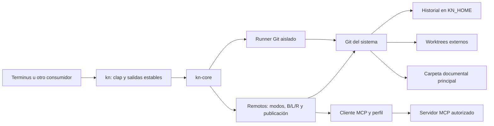

# Arquitectura de kn

kn organiza sesiones de agentes sobre carpetas de documentos. Terminus u otro consumidor decide cuándo usarlo; una carpeta de código sigue el flujo Git de ese consumidor. Una persona puede editar la carpeta documental sin instalar kn.

## Componentes y dependencias

| Componente | Responsabilidad | Fuente |
| --- | --- | --- |
| CLI | Parseo, alias, `-C`, salidas y exit codes | [main.rs](crates/kn/src/main.rs) |
| Workspace | Descubrimiento de `.kn`, UUID, ubicación y locks | [workspace.rs](crates/kn-core/src/workspace.rs) |
| Engine | Procesos Git con variables/configuración aisladas | [git.rs](crates/kn-core/src/git.rs) |
| Operaciones | Status, diff, commit, log, restore | [ops.rs](crates/kn-core/src/ops.rs) |
| Sesiones | Crear, actualizar e integrar worktrees | [sessions.rs](crates/kn-core/src/sessions.rs) |
| Consultas | `rev-parse` y porcelain | [plumbing.rs](crates/kn-core/src/plumbing.rs) |
| Protocolo | Envelope y errores tipados | [error.rs](crates/kn-core/src/error.rs) |
| Remotos | Modos de transferencia, observación, comparación B/L/R y publicación con diario | [remote/](crates/kn-core/src/remote/) |
| Cliente MCP | HTTP sin redirecciones, Streamable HTTP, perfiles, OAuth y almacén del sistema | [mcp.rs](crates/kn-core/src/remote/mcp.rs), [oauth.rs](crates/kn-core/src/remote/oauth.rs) |

Git en PATH es una dependencia de ejecución. El runner desactiva configuración global y de sistema, hooks, firmas y normalización/filtros de contenido. No hay servidor propio, watcher, base de datos ni dependencia de Terminus. Los remotos cloud se alcanzan como cliente de un servidor MCP que la persona autoriza; ningún proveedor está certificado. Diseño: [remotos mediante MCP](docs/MCP-REMOTES.md).

## Almacenamiento

| Ubicación | Contenido |
| --- | --- |
| `<principal>/.kn/config.json` | Schema 2, UUID local y rol de sesión |
| `<principal>/.kn/kn.lock` | Lock de inicialización |
| `$KN_HOME/repos/<uuid>/` | Objetos, referencias, índice principal y registros Git de worktrees |
| `$KN_HOME/repos/<uuid>/location.json` | Última ubicación registrada de la principal |
| `$KN_HOME/repos/<uuid>/kn.lock` | Coordinación de operaciones kn del espacio |
| `$KN_HOME/sessions/<uuid>/<nombre>/` | Documentos de sesión, gitfile y configuración `.kn` local |
| `$KN_HOME/repos/<uuid>/remote/` | Modo de transferencia, remotos con copia del perfil, última observación y diarios de publicación |
| `refs/kn/remotes/<alias>/{observed,base}` | Commits R (última observación completa) y B (última reconciliación) |

KN_HOME usa `~/.kn` por defecto (USERPROFILE en Windows). La principal no recibe un `.git` de kn. Los archivos `.git` existentes del usuario se conservan. Los datos de motor y las sesiones deben estar fuera de carpetas sincronizadas; la comprobación actual solo rechaza KN_HOME dentro de la principal, no detecta todos los proveedores del sistema.

El UUID es local, no una identidad cloud compartida. Copiar `.kn/config.json` no copia el historial. La configuración usa escritura temporal y rename; esto no hace atómico todo un commit o checkout. Git sigue siendo la fuente de HEAD: no se duplica su valor en un state.json.

## Flujo de edición

1. `init` captura los documentos iniciales. Un commit vacío interno permite abrir worktrees incluso si no hay documentos.
2. `worktree add` observa cambios manuales de la principal, guarda una referencia `external_observation` y crea la sesión desde main.
3. `commit` guarda documentos permitidos de la sesión. `log` omite versiones sin cambios documentales.
4. `worktree update` observa de nuevo la principal y usa merge de Git dentro de la sesión. Los conflictos permanecen ahí.
5. `worktree finish` observa la principal y exige avance fast-forward desde ella hacia la sesión limpia; si divergen, pide actualizar. La sesión se conserva.
6. `restore` guarda cambios pendientes, valida el objetivo y protege obstrucciones no versionadas antes del checkout de dos árboles; registra el resultado sin reescribir HEAD hacia atrás.

Las observaciones no conocen al autor externo. Los commits usan la identidad técnica `kn <kn@local>` y un trailer `Kn-Reason`. Los snapshots sin cambios no crean commits adicionales, salvo que Git deba terminar una integración.

## Flujo remoto

1. `mode set` elige quién transfiere; sin un modo que use MCP, kn no contacta servidores.
2. `fetch` enumera completo el remoto activo e importa sus documentos como un commit R cuyo padre es la base B, en refs reservadas. main y sus documentos no cambian.
3. `status` compara B, L (main) y R por documento; `git merge-tree` distingue divergencia de conflicto.
4. `pull`, dentro de una sesión, integra R con Git. B avanza cuando main contiene esa observación.
5. `push`, solo en modo `mcp`, publica un commit fijo de main con escrituras condicionadas por revisión. Anota cada operación en un diario y marca la publicación completa solo cuando una observación nueva la muestra.

## Lecturas, concurrencia y límites

Las consultas de máquina usan un lock compartido existente y no crean archivos; las operaciones de escritura usan lock exclusivo con espera máxima de dos segundos. `status`/`diff` de aplicación no cambian documentos, aunque la apertura puede crear el archivo de lock externo si falta. Las pruebas cubren copias, movimientos y ausencia de escrituras en inspect.

Los locks no inmovilizan aplicaciones externas ni clientes cloud. Una escritura concurrente o un fallo de disco puede interrumpir la captura o integración. El flujo local no tiene diario de recuperación; la publicación remota tiene diario por operación, pero no es atómica para la carpeta. Tampoco hay importación del historial Go ni respaldo de archivos ignorados. Las carpetas vacías solo se reportan. Los detalles de interfaz están en [CLI](docs/CLI.md); las decisiones de producto previas, en [evaluación y propuesta](docs/RUST-AND-COLLABORATION.md).
