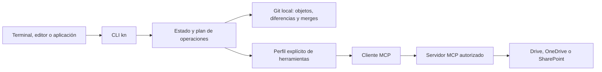

# Propuesta: remotos documentales mediante MCP

Estado: propuesta para revisión, sin implementación. Fecha: 2026-09-10.

Origen: solicitud del usuario en la conversación de desarrollo de esta fecha: consultar e integrar carpetas remotas desde código, sin agentes, sin registrar aplicaciones OAuth propias de kn y sin exigir que cada usuario cree registros en Google o Microsoft. Destinos deseados: Google Drive, OneDrive y SharePoint. Esta propuesta todavía no selecciona ni certifica un servidor MCP concreto.

## Resultado esperado y alcance

Una persona conecta kn a un servidor MCP que ya ofrece acceso autorizado a sus documentos. Desde cualquier terminal, editor o aplicación consumidora puede consultar diferencias locales/remotas, incorporar cambios y publicar un commit revisado. Un programa decide las operaciones con reglas explícitas; no interviene un modelo de lenguaje.

kn actúa como **cliente MCP**. No necesita exponer un servidor MCP propio. Tampoco administra cuentas de Google/Microsoft ni reutiliza automáticamente sesiones del navegador o tokens de otras aplicaciones. El operador del servidor resuelve su integración con el proveedor; kn debe resolver su propia autorización como cliente del servidor cuando este la exija.

Esto evita mantener adaptadores directos de las APIs documentales dentro del núcleo, pero mantiene una dependencia externa: el servidor MCP y su contrato de herramientas. Un servidor que exige al usuario crear credenciales del proveedor no satisface la experiencia propuesta. Si el servidor también exige registrar manualmente el cliente kn, debe declararse incompatible con ese requisito, no presentarse como login listo.

El núcleo local actual sigue definido en [arquitectura](../ARCHITECTURE.md) y el CLI disponible en [CLI](CLI.md). Actualmente `connect`, `push`, `pull` y `status --refresh` no están implementados. Ningún ejemplo de este documento es una instrucción ejecutable del build actual.

## Modos de carpeta

| Modo | Transferencia | Autorización | Estado remoto verificable por kn |
| --- | --- | --- | --- |
| Local | Ninguna | Ninguna | No aplica |
| Sincronizada por cliente de escritorio | Drive/OneDrive instalado | La administra ese cliente | Desconocido; observar archivos locales no demuestra sincronización |
| Remoto MCP | Operaciones explícitas de kn mediante el servidor | El usuario autoriza la conexión admitida por el servidor | Según capacidades comprobadas y última observación |

Compartir define acceso de otras personas; sincronizar define transferencia. Una carpeta privada o compartida puede usar cualquiera de los modos aplicables. La principal del modo MCP debe estar fuera de sincronización automática para evitar dos publicadores sobre sus archivos. KN_HOME y los worktrees permanecen fuera de cualquier sincronización en todos los modos.

## Arquitectura propuesta

MCP define descubrimiento e invocación mediante `tools/list` y `tools/call`, esquemas y resultados; no define operaciones universales para carpetas cloud. El cliente debe completar inicialización, negociar versión/capacidades y manejar el ciclo de sesión del transporte. La primera implementación propuesta usaría servidores remotos con Streamable HTTP y autorización compatible; stdio queda fuera de esa primera entrega. [Arquitectura MCP](https://modelcontextprotocol.io/docs/learn/architecture), [herramientas](https://modelcontextprotocol.io/specification/2025-11-25/server/tools), [transportes](https://modelcontextprotocol.io/specification/2025-11-25/basic/transports).

Cada servidor compatible necesita un perfil revisado: nombres exactos de herramientas, mapeo de argumentos, esquemas de respuesta, paginación, semántica de errores y operaciones disponibles. No se deducen acciones de descripciones en lenguaje natural. Un cambio incompatible de esquema suspende esa operación hasta actualizar y probar el perfil. Que una llamada MCP termine correctamente no prueba que la operación documental haya terminado: se revisan también `isError`, el resultado estructurado y los recibos del proveedor.

“Determinista” describe la selección de pasos a partir de entradas, estado y respuestas verificadas. El estado remoto puede cambiar y los resultados pueden diferir; no significa ausencia de fallos, carreras ni consistencia transaccional.

## Contrato mínimo de capacidades

Los nombres siguientes son conceptos internos propuestos, no herramientas estándar MCP ni campos ya publicados del CLI.

| Capacidad | Evidencia exigida | Si falta |
| --- | --- | --- |
| Identificar destino | Cuenta/contexto, contenedor y raíz con IDs estables; límites de acceso | Rechazar conexión documental |
| Enumerar | Paginación completa, IDs, jerarquía y distinguir error de lista vacía | No calcular estado global ni inferir borrados |
| Leer versión | Bytes completos, revisión vinculada a esos bytes y detección de cambios durante descarga | Estado `unknown`; no construir base confiable |
| Observar cambios | Cursor de cambios o inventario completo verificable; tratamiento de cursor vencido | Volver a inventariar o informar estado incompleto |
| Modificar contenido | Condición de revisión aplicada por el servidor en la escritura | Bloquear actualización de archivos existentes |
| Crear | Protección contra colisiones/duplicados e identidad recuperable tras respuesta perdida | Bloquear creación automática |
| Renombrar/mover/eliminar | Precondiciones específicas por operación e identidad estable | Bloquear esas operaciones del plan |
| Confirmar resultado | Revisión/ID resultantes y consulta para reconciliar reintentos | No marcar publicación completa |

Las capacidades declaradas por el servidor no bastan: se ensayan con dos clientes y fallos intermedios. No extrapolar una precondición de metadatos a cargas de contenido. Un MCP de solo búsqueda/lectura puede servir para explorar documentos sin habilitar publicación. Un servidor puede soportar un subconjunto de operaciones; kn bloquea el plan completo antes de escribir si alguna acción necesaria carece de soporte.

Google Drive y Microsoft Graph son destinos documentales, no remotos Git. El soporte de unidades compartidas, bibliotecas de SharePoint y carpetas compartidas se verifica por separado; no se infiere del nombre del proveedor. [Unidades compartidas de Drive](https://developers.google.com/workspace/drive/api/guides/enable-shareddrives), [archivos de Microsoft Graph](https://learn.microsoft.com/en-us/graph/api/resources/onedrive).

## Estado persistido y comparación con Git

Todo estado de coordinación reside bajo KN_HOME, fuera de los documentos sincronizados. Diseño lógico, aún sin esquema ni rutas estables:

- Conexión: alias remoto, endpoint autorizado, perfil/versionado del contrato, referencia de cuenta y IDs del destino. Credenciales en el almacén seguro del sistema, nunca en documentos, argumentos o recibos.
- Observación: IDs por archivo, rutas normalizadas, revisiones remotas y objetos Git que representan los bytes observados; cursor y marca de completitud. Nombres duplicados, colisiones de mayúsculas, rutas inseguras y enlaces no representables producen conflicto, no sobrescritura.
- Base compartida local: árbol Git de la última reconciliación completa entre local y remoto. No es simplemente el último estado descargado.
- Publicación: ID de operación, commit objetivo fijo, precondiciones y resultado por archivo. Estados propuestos `planned`, `in_progress`, `partial`, `complete`.

Git sigue siendo el único motor de versiones y merge. Los documentos remotos se importan a referencias locales reservadas; no se modifica HEAD de main para consultar. El grafo de esas observaciones debe preservar el ancestro común elegido para que el merge de Git use la base correcta. Se prueba esa propiedad; no basta con anexar cada descarga al HEAD local.

La comparación utiliza B (base reconciliada), L (commit local de main) y R (observación remota completa). Cambios de trabajo sin commit se muestran aparte: no se publican implícitamente. La autenticación y el estado de transferencia también son dimensiones separadas.

| Relación de árboles | Estado propuesto | Acción |
| --- | --- | --- |
| L = R | `synced` | Sin diferencias documentales en esa observación |
| L ≠ B, R = B | `local_ahead` | Preparar publicación |
| L = B, R ≠ B | `remote_ahead` | Incorporar remoto en una sesión |
| L ≠ B, R ≠ B, L ≠ R | `diverged` | Ensayar merge Git en una sesión; puede ser limpio |
| Merge Git con entradas sin resolver | `conflicted` | Resolver dentro de la sesión |
| Sin B, lectura incompleta, permisos insuficientes o estado obsoleto | `unknown` | Observar o reconciliar antes de publicar |

`local_ahead` y `remote_ahead` describen diferencias documentales respecto de B, no conteos de commits de un servidor Git. Un cambio remoto manual puede importarse como otro commit local; no se promete el mismo grafo entre máquinas. Binarios en conflicto requieren resolución explícita; documentos nativos de Google quedan fuera del primer alcance hasta definir exportación y pérdida de información.

## Flujo de operaciones propuesto

1. **Conectar:** autorizar el cliente MCP y validar servidor/perfil/destino. No hacer descargas destructivas ni publicaciones como efecto del login. Conectar una carpeta local no vacía exige reconciliación inicial explícita; sin base no se elige automáticamente un ganador.
2. **Observar (`fetch`):** obtener metadatos y bytes faltantes, verificar sus revisiones e importar R a referencias Git locales. Un fetch no cambia documentos de main ni avanza B. Si no hay snapshot de carpeta, se declara consistencia por archivo y se revalida; los archivos que cambian durante la lectura requieren reintento acotado o estado incompleto.
3. **Consultar:** comparar B/L/R y mostrar antigüedad/completitud de la observación. Sin red, mostrar el último estado como almacenado, no como confirmación actual. Consultar no escribe en el proveedor.
4. **Incorporar (`pull`):** observar y preparar la integración mediante Git en una sesión externa. Si hay ediciones manuales locales, conservarlas mediante el flujo actual de observación. Resolver conflictos allí y usar las reglas de integración a main. B solo avanza al confirmar la reconciliación; no al empezar el merge ni después de un fetch aislado.
5. **Publicar (`push`):** fijar un SHA de main, comprobar divergencias, preparar operaciones desde ese árbol y verificar todas sus capacidades/precondiciones. Solo transferir los documentos del plan, excluyendo `.git`, `.kn`, KN_HOME y symlinks. La política de borrados debe ser explícita en el plan revisado.
6. **Confirmar o recuperar:** aplicar condiciones de revisión al escribir, guardar recibos y verificar resultados. Actualizar B únicamente al completar y verificar la reconciliación. Una respuesta perdida requiere consultar el resultado antes de repetir; no reintentar creaciones o borrados a ciegas. Una publicación parcial conserva el diario y no ejecuta rollback remoto indiscriminado que pueda borrar trabajo ajeno.

Una revisión previa de la carpeta no elimina la carrera entre consulta y escritura. Las condiciones protegen los archivos cubiertos, no crean una transacción de carpeta: otro colaborador puede agregar documentos no incluidos en el plan. La observación final debe detectar cambios adicionales o declarar incertidumbre. Un manifiesto o lock subido al final tampoco ofrece exclusión entre máquinas.

## Interfaz a discutir, no implementada

Conservar nombres Git donde describan la operación: `remote` para configurar destinos, `fetch` para observar, `pull` para incorporar, `push` para publicar. El `connect` reservado actualmente puede quedar como alias de configuración cuando se concrete la sintaxis. No prometer paridad de argumentos con Git.

Extender el envelope JSON existente con esquema de datos por operación: alias/destino, estado B/L/R, frescura, capacidades verificadas y conflictos estructurados. Mantener `status --porcelain` como estado Git local; no introducir ahí campos remotos ni cambiar el formato de consumidores existentes. `status --refresh` y `diff --remote` solo se habilitan después de definir y probar sus contratos. Con varios remotos, la base y observaciones son independientes por destino.

## Autorización y límites de confianza

Para servidores HTTP protegidos, kn implementaría el flujo cliente exigido por MCP, validación de recurso/audiencia, PKCE y almacenamiento/renovación de credenciales cuando corresponda. La compatibilidad de registro del cliente debe validarse con el servidor seleccionado: MCP no garantiza que todos permitan autorizar una aplicación nueva sin configuración administrativa. [Autorización MCP](https://modelcontextprotocol.io/specification/2025-11-25/basic/authorization).

No extraer tokens de otro cliente ni enviar tokens de Google/Microsoft a destinos arbitrarios. Validar endpoints, redirecciones y destinos de descarga/subida antes de enviar credenciales; un token del servidor MCP no se adjunta a una URL de archivo por defecto. El servidor y su operador reciben acceso a los documentos: su autorización debe ser una decisión explícita del usuario. La configuración de conexión se mantiene local y no se ejecutan comandos encontrados en una carpeta compartida.

## Entregas y criterios de aceptación

1. **Seleccionar servidores y perfiles:** demostrar acceso desde un cliente propio, login sin registros manuales del usuario, herramientas y esquemas necesarios. Publicar matriz de lectura/escritura por servidor y proveedor. Si ninguno cumple, registrar el bloqueo y conservar el modo de carpeta sincronizada.
2. **Cliente y observación:** implementar autorización del MCP elegido, conexión, lectura y estado B/L/R. Pruebas con servidor de ensayo, paginación, datos malformados, cursores vencidos, revocación y cambios durante descarga. Cero escrituras remotas y cero cambios de documentos principales al consultar.
3. **Integración local:** ensayar texto, binarios, borrados concurrentes, renombrados y cambios humanos en main. Verificar que Git resuelve sobre la base correcta y que los conflictos quedan en sesiones.
4. **Publicación:** exigir pruebas por operación con dos cuentas, revisión cambiada justo antes de escribir, timeout después de aplicar una escritura, fallo a mitad de lote y recuperación tras reiniciar kn. Ninguna capacidad se anuncia por pasar únicamente mocks.
5. **Contrato y entrega:** esquemas JSON, pruebas de consumidores y documentación actualizada. Git/porcelain local conserva compatibilidad. Pruebas reales con documentos sintéticos en Google Drive, OneDrive y bibliotecas de SharePoint; resultados registrados por destino.

## Relación con la propuesta previa y validación de este documento

La [propuesta previa de colaboración](RUST-AND-COLLABORATION.md#diseño-propuesto-carpeta-compartida-y-autenticación) planteaba autorización del proveedor y tokens en el proceso. Esta revisión propone delegar ese acceso en un servidor MCP y autorizar kn frente a ese servidor. La ruta previa queda documentada como antecedente; aprobar esta propuesta seleccionaría MCP para la siguiente fase, sin habilitar ambas vías implícitamente.

Revisión documental del 2026-09-10: el CLI actual continúa sin cloud; esta entrega no modifica Rust ni declara proveedores disponibles. Criterios de lectura cubiertos: quién autentica, ausencia de agente, diferencia entre observar e integrar, base común, capacidades parciales y recuperación. Pendientes medibles: servidor compatible seleccionado, login real, operaciones protegidas y pruebas de proveedor. Las referencias oficiales sustentan el protocolo; la matriz y los flujos anteriores son decisiones propuestas de kn.
