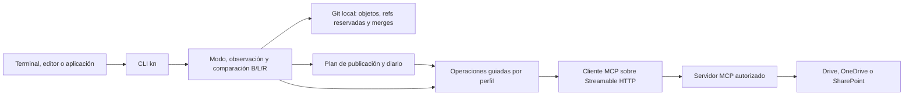

# Remotos documentales mediante MCP

Estado: implementado en el núcleo y la CLI (versión sin publicar) y verificado contra el servidor de referencia de las pruebas. **Ningún proveedor está certificado.** Google Drive, OneDrive y SharePoint siguen pendientes de tres cosas: un servidor MCP seleccionado, su perfil revisado y pruebas reales con dos cuentas. Propuesta de origen: [PR #5](https://github.com/soydanil/kn/pull/5). Modos y prioridad de publicación: [issue #6](https://github.com/soydanil/kn/issues/6).

Origen: la persona pidió consultar e integrar carpetas remotas desde código, sin agentes, sin registrar aplicaciones OAuth propias de kn y sin exigir registros en Google o Microsoft. Destinos deseados: Google Drive, OneDrive y SharePoint.

## Resultado y alcance

Una persona conecta kn a un servidor MCP que ya ofrece acceso autorizado a sus documentos. Desde cualquier terminal, editor o aplicación consumidora puede consultar diferencias entre local y remoto, incorporar cambios y publicar un commit revisado. Un programa decide las operaciones con reglas explícitas; no interviene un modelo de lenguaje.

kn actúa como **cliente MCP**; no expone un servidor propio. No administra cuentas de Google o Microsoft ni reutiliza sesiones del navegador o tokens de otras aplicaciones. El operador del servidor resuelve la integración con el proveedor; kn resuelve su propia autorización como cliente de ese servidor.

La dependencia externa es el servidor MCP y su contrato de herramientas. Un servidor que exige a la persona crear credenciales del proveedor no cumple la experiencia buscada. Uno que exige registrar kn manualmente, sin registro dinámico, recibe `UNSUPPORTED_CAPABILITY` en `kn remote login`; kn no lo presenta como un inicio de sesión listo.

## Modos de transferencia

El modo dice quién transfiere los documentos de la carpeta. La prioridad elige al responsable de publicar; no concede permiso para sobrescribir automáticamente los cambios del otro lado.

| Modo | Quién transfiere | Qué hace kn mediante MCP |
| --- | --- | --- |
| `local` (predeterminado) | Nadie | Nada: no contacta servidores |
| `desktop_sync` | Cliente de Drive/OneDrive | Nada; sesiones e integración local como siempre |
| `desktop_sync_observed` | Cliente de Drive/OneDrive | Observa (`fetch`, `status --refresh`, `pull` hacia una sesión). Toda escritura se rechaza antes de llamar al servidor |
| `mcp` | kn | Observa y publica con `push`, con precondiciones por operación |

Reglas:

- `kn mode set` nunca transfiere documentos. Los modos que usan MCP nombran un remoto (`--remote <alias>`); kn solo opera ese remoto. Los demás remotos configurados conservan su base y sus observaciones por separado.
- `mcp` exige `--primary-outside-sync`: la persona declara que ningún cliente de escritorio sincroniza la principal. kn no puede detener a ese cliente. Si la ruta de la principal contiene una carpeta conocida de cliente de sincronización (`Google Drive`, `OneDrive…`, `CloudStorage`, `Dropbox`, …), el cambio se rechaza y queda pendiente hasta mover la principal con el mecanismo de kn (mover la carpeta y ejecutar `kn init`). Esta detección es auxiliar: su ausencia no prueba que la carpeta esté fuera de sincronización.
- Un KN_HOME dentro de una carpeta sincronizada conocida impide los modos que usan MCP.
- Una publicación sin verificar bloquea el cambio de modo hasta que `kn fetch` la cierre.
- No hay fallback automático entre publicadores. Si falla uno, kn informa y se detiene.

Compartir define quién accede; sincronizar define quién transfiere. Son dimensiones distintas.

## Arquitectura

| Módulo | Responsabilidad |
| --- | --- |
| [http.rs](../crates/kn-core/src/remote/http.rs) | HTTP sin seguir redirecciones; solo https, o http en loopback |
| [mcp.rs](../crates/kn-core/src/remote/mcp.rs) | `initialize`, `tools/list` paginado, `tools/call`, sesión `Mcp-Session-Id`, respuestas JSON o SSE |
| [profile.rs](../crates/kn-core/src/remote/profile.rs), [driver.rs](../crates/kn-core/src/remote/driver.rs) | Perfil revisado, esquemas fijados por SHA-256 y operaciones documentales |
| [oauth.rs](../crates/kn-core/src/remote/oauth.rs), [credentials.rs](../crates/kn-core/src/remote/credentials.rs) | Autorización de kn como cliente MCP y almacén seguro del sistema |
| [config.rs](../crates/kn-core/src/remote/config.rs) | Modos y configuración de remotos bajo KN_HOME |
| [observe.rs](../crates/kn-core/src/remote/observe.rs), [state.rs](../crates/kn-core/src/remote/state.rs) | Observación completa hacia refs Git y comparación B/L/R |
| [publish.rs](../crates/kn-core/src/remote/publish.rs) | Plan desde un commit fijo, escrituras con precondición y diario |

MCP define el descubrimiento y la invocación de herramientas; no define operaciones de carpetas. Cada servidor necesita un [perfil revisado](MCP-PROFILES.md) con los nombres exactos de herramientas, el mapeo de argumentos, los punteros al resultado, la paginación y los códigos de error. Un cambio de esquema desactiva esa operación (`PROFILE_MISMATCH`) hasta que el perfil se actualiza y se prueba. Que una llamada termine sin error no prueba que la operación documental haya terminado: kn revisa `isError`, el resultado estructurado y, al final, una observación nueva. El transporte stdio no está implementado.

«Determinista» describe cómo se eligen los pasos: a partir de entradas, estado y respuestas verificadas. El remoto puede cambiar entre llamadas. No significa ausencia de fallos, de carreras ni consistencia transaccional.

## Capacidades exigidas

| Capacidad | Cómo la exige kn | Si falta |
| --- | --- | --- |
| Identificar destino | `identify` sobre la raíz en `kn remote verify`; debe ser carpeta | `verify` falla; sin `identify`, la raíz no se comprueba |
| Enumerar | Paginación completa desde la raíz; un error o una página que no avanza no es una lista vacía | Observación incompleta (`REMOTE_INCOMPLETE`); nunca se infieren borrados |
| Leer versión | Bytes y la revisión que el servidor liga a esos bytes | Observación incompleta |
| Observar cambios | Inventario completo en cada `fetch`; los bytes se reutilizan cuando la revisión no cambió | No hay cursor de cambios |
| Modificar contenido | `update` con `{expected_revision}` en sus argumentos | Operación no disponible; el plan se bloquea antes de escribir |
| Crear | `create`/`create_folder` con `fails_if_exists` declarado | Operación no disponible |
| Eliminar | `delete` con `{expected_revision}` y `--allow-deletes` explícito | Operación no disponible, o `INVALID_INPUT` sin la opción |
| Renombrar/mover | No se usa: un renombrado se publica como borrar y crear | Se pierde la identidad remota del archivo (permisos y comentarios por archivo) |
| Confirmar resultado | Observación completa posterior; cada operación del diario debe verse aplicada | La publicación no se marca completa |

Las capacidades declaradas no bastan: cada una se ensaya con dos clientes y con fallos intermedios antes de certificar un servidor. Un perfil sin escrituras sirve para `desktop_sync_observed`. Google Drive y Microsoft Graph son destinos documentales, no remotos Git. El soporte de unidades compartidas, bibliotecas de SharePoint y carpetas compartidas se verifica por separado; no se infiere del nombre del proveedor.

## Estado persistido

Todo el estado de coordinación vive bajo KN_HOME, fuera de los documentos:

| Ubicación | Contenido |
| --- | --- |
| `$KN_HOME/repos/<id>/remote/mode.json` | Modo, remoto activo y fecha del cambio |
| `…/remote/remotes/<alias>/config.json` | Endpoint, raíz, referencia de cuenta y copia privada del perfil |
| `…/remote/remotes/<alias>/observation.json` | Última observación completa: rutas, IDs, revisiones y blobs, carpetas, elementos no administrados y último intento |
| `…/remote/remotes/<alias>/journal/<operation_id>.json` | Diario de cada publicación: commit objetivo, operaciones, precondiciones, resultados y visibilidad verificada |
| `refs/kn/remotes/<alias>/observed` | Commit R de la última observación completa |
| `refs/kn/remotes/<alias>/base` | Commit B de la última reconciliación |

Las credenciales viven en el almacén seguro del sistema (servicio `kn`, entrada `mcp/<workspace>/<alias>`) o llegan en `KN_MCP_ACCESS_TOKEN`. Nunca van en documentos, argumentos, diarios, KN_HOME ni mensajes de error.

## Comparación con Git

Git sigue siendo el único motor de versiones y merge. Cada observación completa se importa como un commit cuyo padre es B, en refs reservadas. No se toca HEAD de main. Así `git merge` usa el ancestro correcto. Si el remoto tiene los mismos documentos que main, la observación es el propio commit de main y B avanza hasta él.

B avanza solo al confirmarse una reconciliación:

- cuando main contiene la observación integrada (tras `kn pull` y `kn worktree finish`);
- cuando una observación muestra los mismos documentos que main;
- cuando una publicación queda verificada completa.

Un `fetch` aislado nunca avanza B.

La comparación es por documento. Una diferencia entre L y R está **por publicar** si L se alejó de B y **por incorporar** si R se alejó de B:

| Resultado | Estado | Acción |
| --- | --- | --- |
| Mismos documentos en L y R | `synced` | Nada, según esa observación |
| Solo hay diferencias por publicar | `local_ahead` | `kn push` (modo `mcp`) o esperar al cliente de escritorio |
| Solo hay diferencias por incorporar | `remote_ahead` | `kn pull` en una sesión |
| Ambas, y `git merge-tree` las integra | `diverged` | `kn pull` en una sesión |
| Ambas, y `git merge-tree` deja conflictos | `conflicted` | `kn pull` y resolver en la sesión |
| Sin B o sin observación completa | `unknown` | `kn fetch`, o reconciliar con `kn pull` |

Sin B, `kn pull` integra con historias no relacionadas, así que los documentos que difieren quedan en conflicto: sin base no se elige ganador. Una publicación parcial propia no se confunde con un cambio ajeno: un documento cuyo remoto ya coincide con L deja de estar pendiente. Los cambios sin guardar de la principal se reportan aparte (`uncommitted_local_changes`) y nunca se publican implícitamente.

Los documentos que kn no administra se ven, pero kn nunca los lee, escribe ni borra:

- nativos, como los de Google Docs (`remote_only`);
- los que el conjunto local ignora (`ignored_locally`);
- nombres no representables o reservados (`unrepresentable_name`, `reserved_name`).

Un plan que crearía algo en esas rutas se rechaza. Los nombres duplicados o que coinciden sin distinguir mayúsculas dejan la observación incompleta.

## Operaciones

1. **Configurar:** `kn remote add` guarda el remoto sin contactar al servidor. `kn remote login` autoriza. `kn remote verify` compara herramientas, esquemas y raíz; nunca escribe.
2. **Observar:** `kn fetch` enumera y lee lo necesario, importa R y guarda el intento. Un intento incompleto queda registrado y devuelve `REMOTE_INCOMPLETE`; la última observación completa se conserva.
3. **Consultar:** `kn status` muestra el estado almacenado con su antigüedad (`freshness: stored`). `--refresh` observa antes (`refreshed`). `kn diff --remote|--base` compara la versión actual con R o B. Consultar nunca escribe en el proveedor.
4. **Incorporar:** `kn pull` corre dentro de una sesión. Registra antes los cambios manuales de la principal, observa e integra R con Git. Los conflictos quedan en la sesión; main no cambia hasta `kn worktree finish`.
5. **Publicar:** `kn push` (solo en modo `mcp`) sigue estos pasos:
   1. Fija el commit actual de main y observa el remoto.
   2. Exige `local_ahead`.
   3. Calcula el plan desde R hacia ese árbol: crear carpetas, crear, actualizar y, con `--allow-deletes`, borrar.
   4. Comprueba todas las capacidades antes de la primera escritura. `--dry-run` muestra el plan sin escribir.
   5. Anota cada operación en el diario antes y después de enviarla.
6. **Confirmar o recuperar:** una observación nueva verifica cada operación. Si todas son visibles, la publicación queda completa y B avanza. Si no, el diario queda reemplazado y el siguiente plan parte de lo que muestra el remoto.

Una precondición rechazada devuelve `CONFLICT` sin sobrescribir. Una respuesta perdida devuelve `REMOTE_UNAVAILABLE`. kn no repite a ciegas: la siguiente observación decide si la escritura llegó, y las precondiciones impiden duplicar lo que sí llegó. No hay rollback remoto.

Las precondiciones protegen los archivos del plan; no crean una transacción de carpeta. Otro colaborador puede agregar documentos durante la publicación: la observación final los reporta como cambios por incorporar. Un manifiesto o lock subido al remoto no ofrece exclusión entre máquinas.

## Autorización y límites de confianza

`kn remote login` sigue la autorización de MCP 2025-11-25:

- Sondea el endpoint sin credencial y lee `WWW-Authenticate`.
- Obtiene la metadata del recurso protegido (RFC 9728) y verifica que corresponda al endpoint.
- Descubre el servidor de autorización (RFC 8414 u OpenID) y exige `S256`.
- Se registra con registro dinámico (RFC 7591), sin secreto.
- Abre el navegador con PKCE, `state` e indicador de recurso (RFC 8707).
- Recibe el código en un callback de loopback y guarda los tokens en el almacén del sistema.

Los tokens por vencer se renuevan antes de conectar. Los Client ID Metadata Documents no están soportados: kn no tiene una URL de metadata alojada. [Autorización MCP](https://modelcontextprotocol.io/specification/2025-11-25/basic/authorization).

Una aplicación integradora, como Terminus, entrega el token en `KN_MCP_ACCESS_TOKEN`. kn nunca lo lee de argumentos ni de archivos.

kn solo envía el token al endpoint configurado y no sigue redirecciones. No extrae tokens de otros clientes ni envía tokens de Google o Microsoft. El servidor y su operador reciben acceso a los documentos: autorizarlo es una decisión explícita de la persona. El perfil es un dato: kn guarda una copia y no ejecuta nada encontrado en una carpeta compartida.

## Criterios de aceptación del issue #6

| Criterio | Estado | Evidencia |
| --- | --- | --- |
| Contrato de modos, transiciones y estado JSON; porcelain local intacto | Hecho | [CLI](CLI.md), [esquema](schema/remote-status-v1.json); `status --porcelain` no cambia |
| En `desktop_sync_observed`, toda escritura MCP se rechaza antes de llamar al servidor | Probado | `observed_desktop_mode_integrates_locally_and_never_writes_through_mcp`, `read_only_mode_never_sends_writes` |
| Diferencias por subida o descarga retrasada, observables sin falsa confirmación | Probado con retraso simulado | El estado almacenado sigue en `local_ahead` hasta una observación nueva |
| El merge usa B; los conflictos quedan en sesiones; un fetch no altera main ni avanza B | Probado | `fetch_imports_the_complete_remote_without_touching_main`, `first_reconciliation_conflicts_instead_of_choosing_a_winner` |
| La resolución conserva versiones previas de ambos lados y los cambios sin commit | Probado para la resolución integrada | L y R quedan en el historial Git; la principal se observa antes de integrar |
| Una edición remota entre consulta y publicación invalida la precondición | Probado | `a_remote_edit_between_observation_and_write_is_never_overwritten` |
| Borrados, binarios, permisos, observaciones parciales y archivos solo en línea | Probado; renombrados como borrar y crear | `push_publishes_a_fixed_commit_with_explicit_deletions_and_verifies_it`, `an_incomplete_observation_is_reported_and_never_infers_deletions`, `a_wrong_access_token_requires_authorization` |
| El cambio de modo conserva identidad, historial y sesiones; no activa dos vías ni publica | Probado | `mode_transitions_are_explicit_and_contact_no_server` |
| Timeouts después de escribir y fallos a mitad de lote sin duplicados | Probado | `a_lost_write_response_is_verified_by_observation_and_not_repeated` |
| Pruebas reales con dos cuentas y cliente de escritorio activo e inactivo en Drive, OneDrive y SharePoint | **Pendiente** | Requiere un servidor seleccionado y su perfil; los mocks no certifican proveedores |

## Límites conocidos

- Ningún proveedor certificado; `certified_providers` queda vacío en `status`.
- Sin cursor de cambios: cada `fetch` enumera todo el árbol. La consistencia es por archivo, no por instantánea de carpeta.
- Sin renombrados ni movimientos. Las carpetas vacías no se versionan, y kn nunca borra carpetas remotas.
- Documentos nativos de Google fuera del alcance hasta definir su exportación.
- En Linux, el almacén usa el keyring del kernel, que no persiste tras reiniciar.
- Los locks de kn no coordinan otras máquinas. Mientras un comando remoto trabaja, otros procesos kn de la misma carpeta esperan hasta `WORKSPACE_BUSY`.
